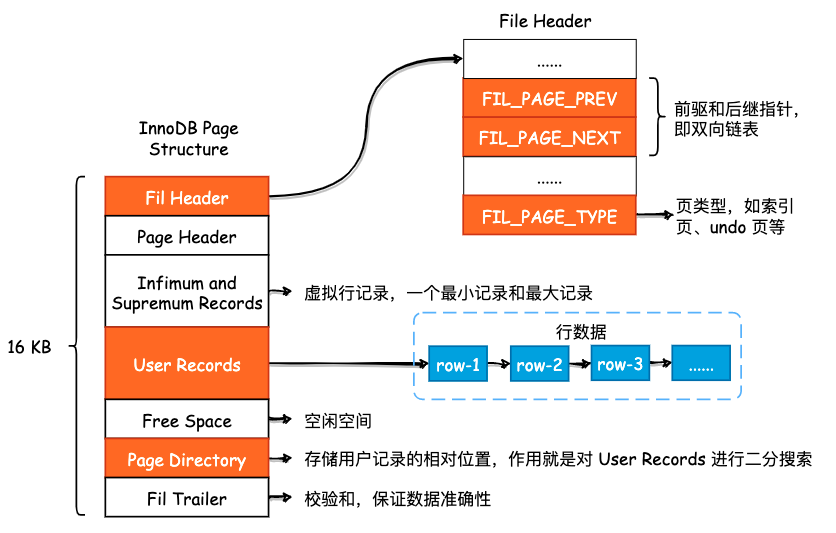
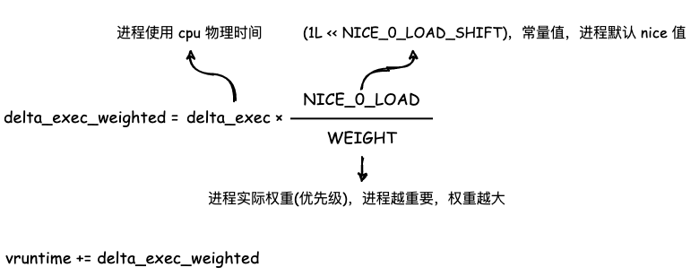

Pythonista，会写 Golang 和 C++，喜欢用图片的方式描绘计算机世界中的精妙设计。

- [Psyduck](https://github.com/SmartKeyerror/Psyduck)，使用 XMind 记录和总结操作系统，数据库，计算机网络等底层设计。

- [Snorlax](https://github.com/SmartKeyerror/Snorlax)，总结常用的数据结构和算法，以及Leetcode 刷题记录

